# Flexbox


WEB从1.0~3.0经过不断的发展,WEB的布局也经历过几个阶段:表格布局,
浮动布局,定位布局,Flexbox布局等.未来还会有像Grid网格布局这样的新型产物.那其实每种布局的出现在当时都很有意义.

Flexbox是CSS3中的一个新特性,这个特性解决我们以前在CSS中遇到的
很多棘手的问题,像内容的伸缩与扩展,垂直居中问题,等分等.当然这个
属性也大量的运用于布局当中,特别是在对移动优先的时代下,各种终端频频出现

Flexbox布局是什么?
Flex是Flexible Box的缩写,是弹性布局的意思,用来为盒模型提供最大的灵活性,
任何一个容器都可以指定为Flex布局

```css
.box{
    display: flex;
}
```
行内元素也可以使用Flex布局
```css
.box{
    display: inline-flex;
}
```

> 注意:设为Flex布局以后,子元素的float,clean和vertical-align都将失效

## Flex解析
使用Flex布局的元素,我们可以称其为Flex容器(Flex Container)简称容器.
它所有的子元素自动成为容器成员,我们称其为Flex项目(Flex item)简称项目.

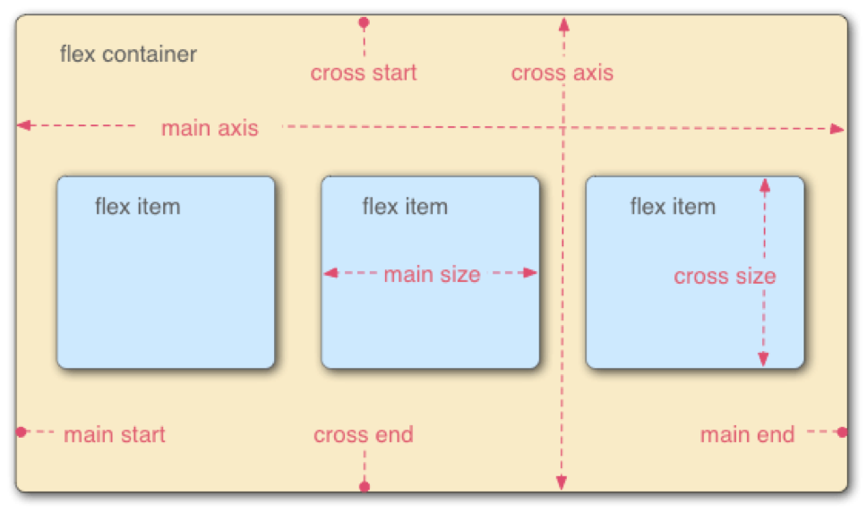

可以看出上图中,容器的主要部分分为两根轴:`水平的主轴`(main axis)和`垂直的交叉轴`(cross axis).主轴的开始位置
与边框的交叉点叫做`main start`,结束位置叫做`main end`;交叉轴的开始位置叫做`cross start`,结束的位置叫做`cross end`.

项目默认沿主轴排列.单个项目占据的主轴空间叫做`main size`,占句的交叉轴空间叫做`cross size`.

## Flex Container 的相关属性
首先作用在Flex容器上的相关属性有以下6个:
+ [flex-direction](#flex-direction)
+ [flex-wrap](#flex-wrap)
+ flex-flow
+ [justify-content](#justify-content)
+ [align-items](align-items)
+ align-content

<a name="flex-direction"></a>
### flex-direction
flex-direction属性主要决定主轴的方向,就是项目的排列方式,默认水平排列,从左到右.
+ row: 默认值,主轴水平方向,起点从左往右
+ row-reverse: 主轴为水平方向,起点从右往左
+ column: 主轴为垂直方向,起点从上往下
+ column-reverse: 主轴为垂直方向,起点从下往上

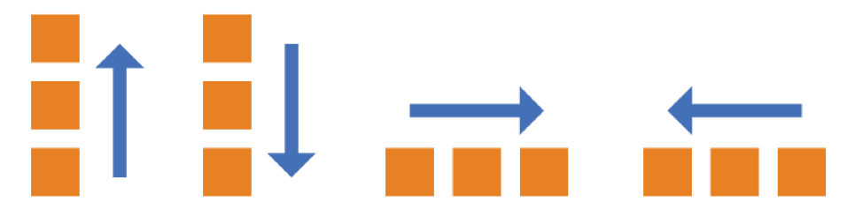

[案例](./src/flex-direction/index.html)

<a name="flex-wrap"></a>
### flex-wrap
默认情况下,我们的flex-item都排在一条直线上,也就是我们所说的轴线上.
那flex-wrap属性就是定义如果一条直线上排不开是否换行的操作.

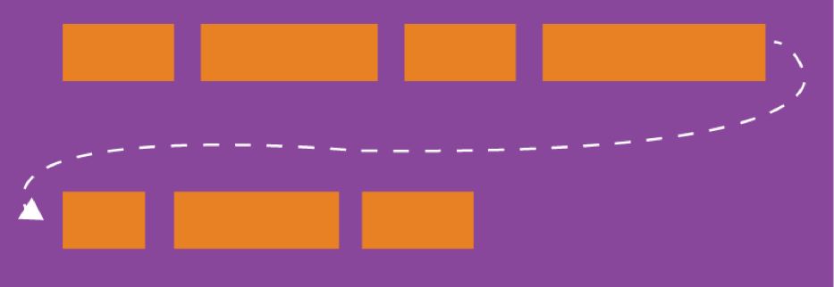

+ nowrap: 默认值,不换行
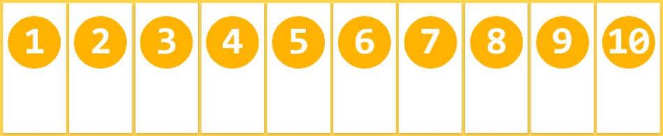
+ wrap: 换行,第一行在上方
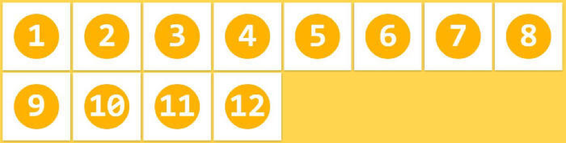
+ wrap-reverse: 换行,第一行在下方


[案例](./src/flex-wrap/index.html)

<a name="justify-content"></a>
### justify-content
justify-content属性定义了flex itemt根据主轴方向的对齐方式
+ flex-start: 默认值.左对齐
+ flex-end: 右对齐
+ center: 居中
+ space-between: 两端对齐,flex item之间的间隔相等
+ space-around: 每个flex item两侧的间隔相等.所以flex item中间的间隔比flex item与边框的间隔大一倍

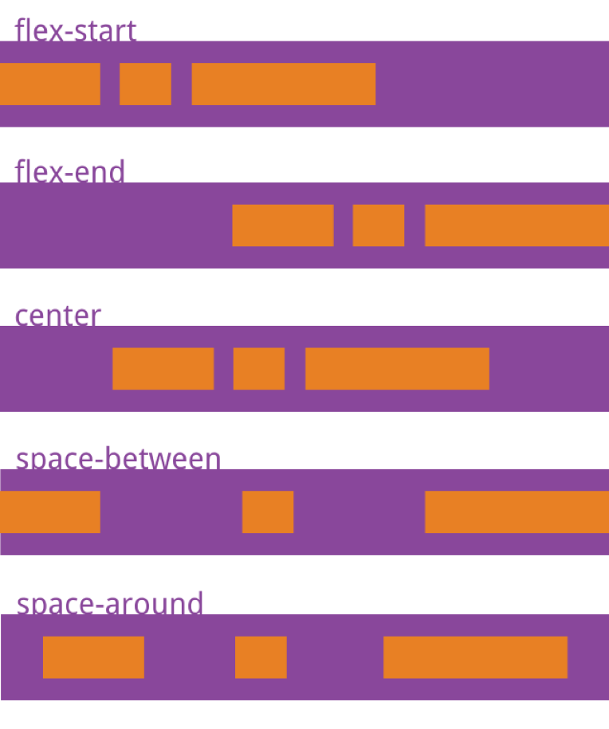

[案例](./src/justify-content/index.html)

<a name="align-items"></a>
### align-items
align-items属性定义flex item在交叉轴上如何对齐
+ flex-start: 垂直的交叉轴的起点对齐
+ flex-end: 垂直的交叉轴的终点对齐
+ center: 垂直的交叉轴的中点对齐
+ baseline: flex item的第一行文字的基线对齐
+ stretch: 默认值,如果flex item未设置高度或auto,将占满整个容器的高度

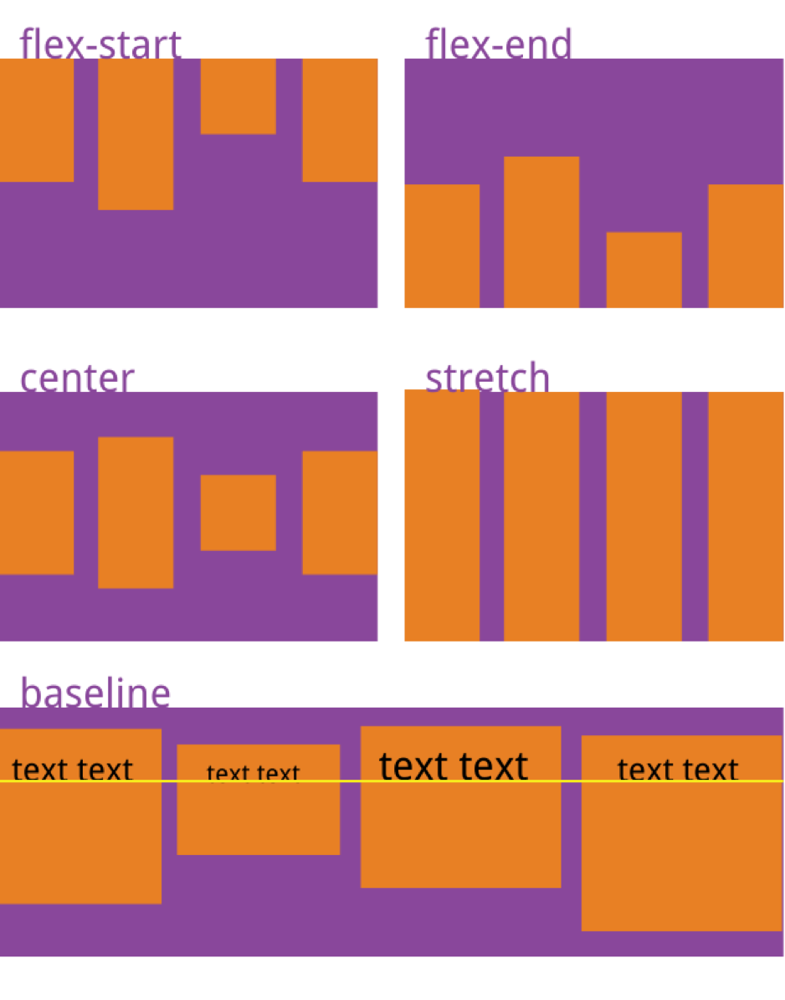

[案例](./src/align-items/index.html)


## flex item
flex item相关属性有以下6个
+ [order](#order)
+ [flex-grow](#flex-grow)
+ [flex-shrink](#flex-shrink)
+ [flex-basis](#flex-basis)
+ [flex](#flex)
+ [align-self](#align-self)

<a name="order"></a>
### order
order属性定义项目的排序顺序.数值越小,排列越靠前
> 注意:order默认为0,可以为负数
```css
.item{
    order:<integer>
}
```

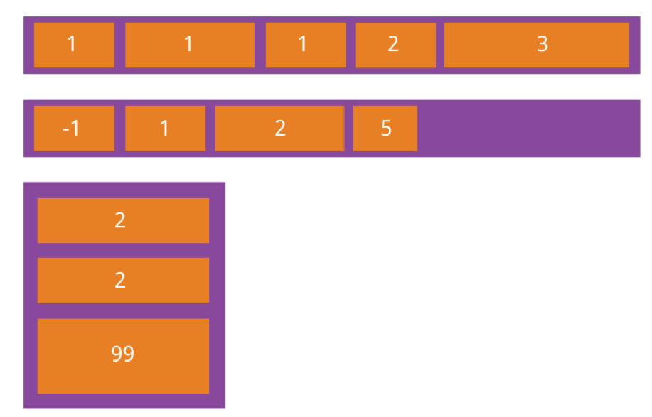

[案例](./src/order)

<a name="flex-grow"></a>
### flex-grow
flex-grow属性定义flex item的放大比例,默认为0,就是如果存在剩余空间,也不放大

如果所有的flex item属性都为1,则将等分剩余的空间,如果一个flex item的属性为2,其它flex item
都为1,则为2的占据剩余空间比为1的大一倍

```css
.item{
    flex-grow:<number>;
}
```

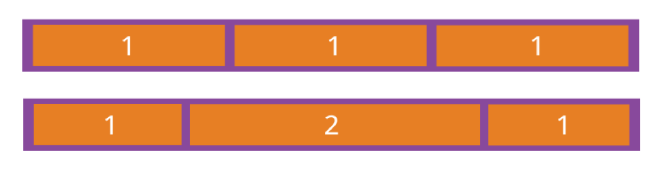

[案例](./src/flex-grow/index.html)

<a name="flex-shrink"></a>
### flex-shrink
flex-shrink属性定了flex item的缩小比例,默认为1,即如果空间不足,该flex item将缩小

如果所有的flex item的flex-shrink属性都为1,当空间不足的时候,都将等比例缩小.如果一个flex item属性为0,
其他项目都为1,则空间不足时,前者不缩小

> 注意: flex-shrink不能为负

```css
.item{
    flex-shrink:<number>;
}
```
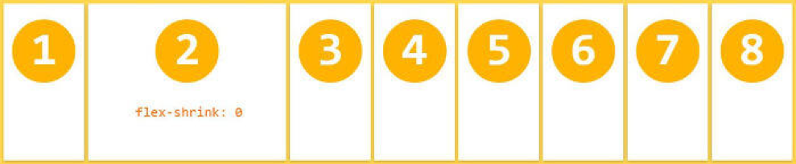

[案例](./src/flex-shrink/index.html)

<a name="flex-basis"></a>
### flex-basis
flex-basis属性定义了在分配偶遇空间之前,flex item占据的主轴空间(main size).
浏览器根据这个属性,计算主轴是否有多余空间,它的默认值为auto,即项目的本来大小

它可以设为跟width或height属性一样的值(像300px),则项目将占据固定空间

```css
.item{
    flex-basis:<length>| auto;
}
```

[案例](./src/flex-basis/index.html)

<a name="flex"></a>
### flex
flex属性是flex-grow、flex-shrink、flex-basis的缩写，默认值为0 1 auto

```css
.item{
    flex:none|[<'flex-grow'> <'flex-shrink'>? || <'flex-basis'> ]
}
```

这个属性有两个快捷键值：auto (1 1 auto) 和 none(0 0 auto)

<a name="align-self"></a>
### align-self
align-self属性允许单个项目有与其他项目不一样的对齐方式，可覆盖align-items属性。默认值为auto，表示继承元素的align-items属性，如果没有父元素，则等同于stretch。

该属性可能取6个值，除了auto，其他都与align-items属性完全一致。

```css
.item{
    align-self:auto | flex-start | flex-end | center | baseline | stretch;
}
```

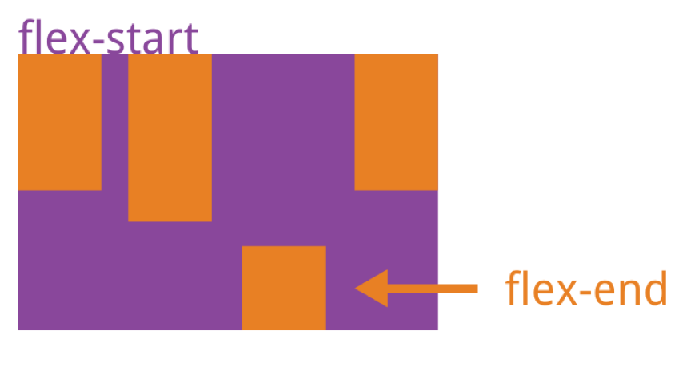
