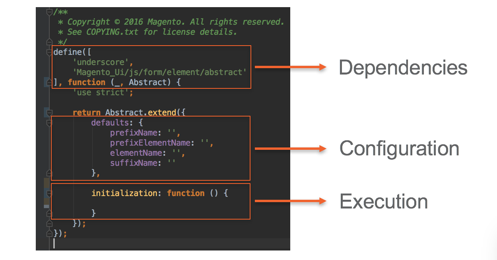

# UI components

# What is a UI component?
UI组件是以下组合:
+ XML declaration
+ JavaScript
+ Related template(s)

## JavaScript class
下图显示了如何实现UI组件的JavaScript类。

## Templates
可以使用KnockoutJS绑定将UI组件绑定到一个或多个HTML模板。

# UI组件列表
